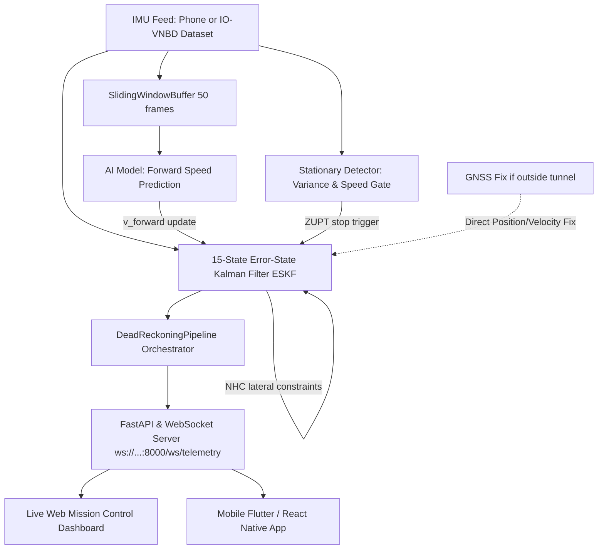

# 🧭 SIH Intelligent Dead Reckoning — Master Team & Codebase Guide

> **Welcome to the Team!**
> This single master guide is designed for every teammate (whether you're working on AI/ML, backend pipelines, mobile app, or frontend visualization).
> It explains the big picture, where every file lives, and exactly where you need to navigate to make your changes.

---

## 📑 Table of Contents
1. [Big Picture: How the System Works](#1-big-picture-how-the-system-works)
2. [Master File & Directory Map](#2-master-file--directory-map)
3. [Where to Navigate to Make Changes (Cheat Sheet)](#3-where-to-navigate-to-make-changes)
   - [A. How to Plug In Your Trained AI Model (`.pt` / `.onnx`)](#a-how-to-plug-in-your-trained-ai-model)
   - [B. How to Load Your Own Dataset CSV (IO-VNBD or Phone Traces)](#b-how-to-load-your-own-dataset-csv)
   - [C. How the Frontend Team Connects (WebSocket & JSON)](#c-how-the-frontend-team-connects)
   - [D. How to Stream Live Data from a Smartphone (Android / iOS)](#d-how-to-stream-live-data-from-a-smartphone)
   - [E. How to Tune Filter & Sensor Parameters](#e-how-to-tune-filter--sensor-parameters)
4. [How to Run Everything (Quick Commands)](#4-how-to-run-everything)
5. [Common Beginner Gotchas & Troubleshooting](#5-common-beginner-gotchas--troubleshooting)

---

## 1. Big Picture: How the System Works

When a car enters an underground tunnel or urban canyon, GPS/GNSS signals freeze or drop to zero.
If you simply integrate raw phone accelerometer data ($p = \iint a \, dt^2$), the car's estimated position will **drift hundreds of meters away within seconds** due to sensor bias and gravity leakage.

Our engine fixes this with a **Hybrid Fusion Architecture**:
1. **Kinematic Gravity Removal & 3D Attitude Tracking:** Keeps track of phone orientation via unit quaternions ($R_{wb}$).
2. **Non-Holonomic Constraints (NHC):** Enforces that cars cannot slide sideways ($v_y^{\text{body}} \approx 0$) or fly vertically ($v_z^{\text{body}} \approx 0$).
3. **Zero Velocity Updates (ZUPT):** Automatically detects when the car is stopped at a traffic light and instantly halts velocity drift.
4. **AI-Assisted Speed Estimation:** Ingests forward velocity predictions from a trained ML model.
5. **Real-time API & Mission Control:** Streams coordinates at 50Hz (every 20ms) over WebSockets to your frontend dashboard.



---

## 2. Master File & Directory Map

Here is the exact layout of the entire codebase and what each file does:

```
SIH Backend Ka codebase/
├── CODEBASE_GUIDE.md                <-- [YOU ARE HERE] Master guide for the team
├── benchmark_stage2.py              <-- Benchmark test runner (validates <10% drift target)
├── run_server.py                    <-- 1-line script to launch backend & web dashboard
│
├── data/
│   └── sample_iovnbd_tunnel_drive.csv  <-- Pre-bundled 50s benchmark dataset (tunnel, turn, stop)
│
├── src/
│   ├── kinematics/
│   │   ├── __init__.py
│   │   └── quaternion.py            <-- 3D rotation math, quaternions, Euler angles, DCM
│   │
│   ├── filters/
│   │   ├── __init__.py
│   │   ├── eskf.py                  <-- The Core Physics Engine (15-state ESKF + NHC + ZUPT)
│   │   └── stationary_detector.py   <-- Detects vehicle stops at lights (ZUPT trigger)
│   │
│   ├── data/
│   │   ├── __init__.py
│   │   └── iovnbd_loader.py         <-- Parses IO-VNBD CSV files & GPS-to-metric ENU converter
│   │
│   ├── pipeline/
│   │   ├── __init__.py
│   │   └── dead_reckoning_pipeline.py <-- Connects buffer, AI stub, detector & filter together
│   │
│   ├── simulation/
│   │   ├── __init__.py
│   │   └── vehicle_simulator.py     <-- Realistic car motion simulator with engine vibrations
│   │
│   └── server/
│       ├── __init__.py
│       ├── app.py                   <-- FastAPI server & WebSocket broadcaster (/ws/telemetry)
│       └── static/
│           └── index.html           <-- Mission Control Web Dashboard (live 2D trajectory canvas)
│
├── tests/
│   ├── test_ekf.py                  <-- Automated unit tests for math and filter
│   └── test_server.py               <-- Automated tests for API and WebSockets
│
└── Essential Docs/
    ├── Problem statement.md         <-- Official SIH Problem Statement
    ├── SIH.md                       <-- Backend engineering role breakdown
    └── backend_prototype.py         <-- Standalone side-by-side script (Stage 1 vs Stage 2)
```

---

## 3. Where to Navigate to Make Changes

### A. How to Plug In Your Trained AI Model

**Target File:** [`src/pipeline/dead_reckoning_pipeline.py`](file:///c:/Coding%20Project(unguarded)/SIH%20Backend%20Ka%20codebase/src/pipeline/dead_reckoning_pipeline.py)

1. Export your trained PyTorch (`.pt` / `.pth`) or ONNX (`.onnx`) model from your training notebook into a new folder: `models/forward_speed_model.onnx`.
2. Open [`src/pipeline/dead_reckoning_pipeline.py`](file:///c:/Coding%20Project(unguarded)/SIH%20Backend%20Ka%20codebase/src/pipeline/dead_reckoning_pipeline.py).
3. Create your model wrapper function:
   ```python
   # Example: ONNX Runtime (fastest for 50Hz real-time inference)
   import onnxruntime as ort
   
   session = ort.InferenceSession("models/forward_speed_model.onnx")
   
   def ai_forward_speed_inference(window_50_samples: np.ndarray) -> float:
       """
       window_50_samples has shape (50, 6): [ax, ay, az, gx, gy, gz]
       Returns predicted vehicle forward speed in m/s.
       """
       input_tensor = window_50_samples.reshape(1, 50, 6).astype(np.float32)
       outputs = session.run(None, {"input": input_tensor})
       speed_pred = float(outputs[0][0])
       return max(0.0, speed_pred)
   ```
4. Pass `ai_speed_estimator=ai_forward_speed_inference` into `DeadReckoningPipeline`:
   ```python
   pipeline = DeadReckoningPipeline(
       sample_hz=50.0,
       enable_nhc=True,
       enable_zupt=True,
       ai_speed_estimator=ai_forward_speed_inference,
   )
   ```
The pipeline will automatically pass the window, run inference, and feed the speed prediction into the Kalman filter every frame!

---

### B. How to Load Your Own Dataset CSV

**Target File:** [`src/data/iovnbd_loader.py`](file:///c:/Coding%20Project(unguarded)/SIH%20Backend%20Ka%20codebase/src/data/iovnbd_loader.py) and [`src/server/app.py`](file:///c:/Coding%20Project(unguarded)/SIH%20Backend%20Ka%20codebase/src/server/app.py)

1. Drop your CSV recording file into the `data/` folder (e.g. `data/my_drive_recording.csv`).
2. Make sure your CSV contains columns for:
   - `timestamp_s`
   - `accel_x`, `accel_y`, `accel_z` ($m/s^2$)
   - `gyro_x`, `gyro_y`, `gyro_z` ($rad/s$)
   - `gnss_valid` (`1` if GPS locked, `0` if tunnel/blackout)
   - `gnss_lat`, `gnss_lon`, `gnss_alt` (GPS coordinates)
3. To stream it through the backend server:
   - In [`src/server/app.py`](file:///c:/Coding%20Project(unguarded)/SIH%20Backend%20Ka%20codebase/src/server/app.py), change line 38:
     ```python
     DEFAULT_DATASET = os.path.join(os.path.dirname(__file__), "..", "..", "data", "my_drive_recording.csv")
     ```
   - Or start the stream dynamically using HTTP POST:
     ```bash
     curl -X POST http://127.0.0.1:8000/api/stream/start -H "Content-Type: application/json" -d "{\"dataset_path\": \"data/my_drive_recording.csv\", \"playback_speed\": 1.0}"
     ```

---

### C. How the Frontend Team Connects

**Target File:** [`src/server/app.py`](file:///c:/Coding%20Project(unguarded)/SIH%20Backend%20Ka%20codebase/src/server/app.py)

Your frontend team (React, Vue, Flutter, Leaflet, or Mapbox) connects directly over WebSocket:
- **WebSocket URL:** `ws://<BACKEND_IP>:8000/ws/telemetry`
- **Stream Frequency:** 50Hz (50 packets per second, ~every 20ms)

**Incoming Packet Format (JSON):**
```json
{
  "type": "TELEMETRY",
  "step": 350,
  "timestamp_s": 7.0,
  "mode": "DEAD_RECKONING",       // "GNSS_FIX", "DEAD_RECKONING", or "STATIONARY_LOCK"
  "gnss_status": "BLACKOUT (OUTAGE)", // "LOCKED (GNSS)" or "BLACKOUT (OUTAGE)"
  "speed_kmh": 43.2,
  "heading_deg": 89.4,             // 0-360 degrees (0 = North/East depending on frame)
  "pos_est": [124.50, 4.20, 0.00], // [X, Y, Z] metric coordinates
  "pos_true": [124.10, 4.00, 0.00],// Ground truth coordinates
  "drift_m": 0.45,                 // Distance error in meters
  "drift_pct": 0.36,               // Drift error percentage (<10% benchmark)
  "total_distance_m": 125.1,
  "outage_duration_s": 2.0,        // Seconds spent inside blackout
  "latency_ms": 0.45,              // Processing time (<20ms required)
  "is_stationary": false
}
```

**Client Control Commands:**
The frontend can send commands to the backend over the same WebSocket:
- `{"action": "START"}`: Starts streaming
- `{"action": "STOP"}`: Pauses streaming
- `{"action": "TOGGLE_GNSS"}`: Toggles GNSS blackout on/off for live presentations!

---

### D. How to Stream Live Data from a Smartphone

**Target Endpoint:** `POST http://<BACKEND_IP>:8000/api/sensor/ingest`

If your mobile app developer wants to send live sensor readings directly from an Android or iPhone device over Wi-Fi, send an HTTP POST request for each sample:
```json
{
  "accel": [0.04, 0.00, 9.81],
  "gyro": [0.00, 0.00, 0.005],
  "gnss_pos": [124.5, 4.2, 0.0],  // or null if GPS dropped!
  "gnss_vel": [12.0, 0.0, 0.0]    // or null
}
```
The backend processes it immediately in `<0.5 ms` and broadcasts the filtered dead-reckoning position to all connected displays!

---

### E. How to Tune Filter & Sensor Parameters

If you notice excessive drift or if the stationary detector triggers too easily:

1. **Stationary / Stop Detector Thresholds:**
   - **File:** [`src/filters/stationary_detector.py`](file:///c:/Coding%20Project(unguarded)/SIH%20Backend%20Ka%20codebase/src/filters/stationary_detector.py)
   - `accel_var_threshold` (default `0.008`): Increase if engine vibrations at stoplights are high; decrease if vehicle stops aren't being detected.
   - `speed_gate_threshold` (default `1.2` m/s): Ensures stops are only triggered when the vehicle is decelerating below ~4.3 km/h.

2. **Kalman Filter Covariances & Noise:**
   - **File:** [`src/filters/eskf.py`](file:///c:/Coding%20Project(unguarded)/SIH%20Backend%20Ka%20codebase/src/filters/eskf.py)
   - `r_nhc` (default `0.15` m/s): Standard deviation for Non-Holonomic Constraints. Smaller value = stronger lateral constraint (less sideways slip).
   - `r_zupt` (default `0.05` m/s): Velocity noise during stops. Smaller value = snaps velocity to zero faster.
   - `sigma_accel_noise` & `sigma_gyro_noise`: Sensor white noise standard deviations.

---

## 4. How to Run Everything

Open PowerShell or Command Prompt in the repository root:

### 1. Launch Mission Control & Backend Server (Recommended)
```bash
python run_server.py
```
👉 Open your browser to: **`http://127.0.0.1:8000`**
Click **"Start Stream"** to watch the car navigate through open roads, enter the tunnel blackout, stop at a red light, make a turn, and exit!

### 2. Run the Official SIH Performance Benchmark Test
```bash
python benchmark_stage2.py
```
Validates the official SIH requirement (<10% drift error over 45 seconds of continuous GNSS tunnel blackout).

### 3. Run Automated Unit Tests
```bash
python -m unittest discover tests
```
Runs all 11 automated test suites covering kinematics, ESKF, stationary detection, REST API, and WebSockets in under 1 second.

### 4. Run the Standalone Prototype Comparison
```bash
python "Essential Docs\backend_prototype.py"
```
Runs a console demonstration of Naive Double-Integration vs. Stage 2 ESKF side-by-side.

---

## 5. Common Beginner Gotchas & Troubleshooting

| Problem | Cause | Quick Fix |
| :--- | :--- | :--- |
| `[Errno 10048] error while attempting to bind on address ('127.0.0.1', 8000)` | Port 8000 is already in use by another instance or process. | Terminate the existing process in Task Manager, or change `port=8001` in `run_server.py`. |
| `ModuleNotFoundError: No module named 'fastapi'` | Dependencies not installed in the active Python environment. | Run `python -m pip install fastapi uvicorn websockets numpy scipy httpx`. |
| Phone app can't connect to `127.0.0.1` | `127.0.0.1` (localhost) is local to your PC only. | Find your PC's local Wi-Fi IP (e.g. `192.168.1.15`) using `ipconfig`, then start `run_server.py` with `host="0.0.0.0"`. Connect phone to `http://192.168.1.15:8000`. |
| Car drifts sideways during sharp turns | Centripetal acceleration or loose phone mount. | Ensure phone orientation alignment is calibrated, or tighten `r_nhc` in `src/filters/eskf.py`. |

---

*Engineered for the Smart India Hackathon (SIH) Intelligent Dead Reckoning Challenge.*
